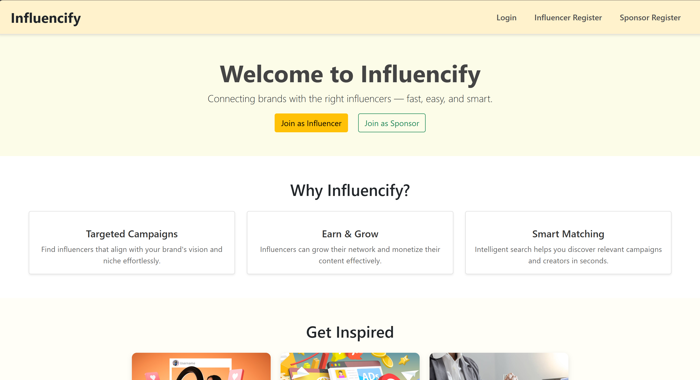

# 🎯 Influencify

**Connecting brands with the right influencers — fast, easy, and smart.**



---

## 🛠️ Tech Stack

- **Backend:** Flask (Python)
- **Frontend:** HTML + CSS (Jinja templating)
- **Database:** SQLite
- **Deployment:**
  - Backend: Render
  - Frontend: Vercel

---

## 🚀 Features

### 👤 User Roles
- **Influencer** – Register, view campaigns, accept sponsorships.
- **Sponsor** – Register, create campaigns, match with influencers.
- **Admin** – View analytics, moderate content, flag users.

### 🎯 Core Functionalities
- Smart matching algorithm
- Targeted campaign management
- Influencer discovery
- Responsive UI
- Secure login (Flask-Login)

---

## 🖼️ UI Preview

> Home Page Highlights:

- ✅ Hero section with "Join as Influencer" and "Join as Sponsor" CTAs
- ✅ Feature section: Targeted Campaigns, Earn & Grow, Smart Matching
- ✅ Inspiring campaign thumbnails below


---

## 📂 Folder Structure
```bash
├── app.py
├── backend/
│ ├── controllers.py
│ ├── models.py
│ └── api_controller.py
├── templates/
│ └── home.html
├── static/
│ ├── style.css
│ └── ...
├── instance/
├── requirements.txt
├── Procfile
└── README.md
```
---

## 🧪 Run Locally

```bash
# Clone the repo
git clone https://github.com/yourusername/influencify.git
cd influencify

# Create and activate a virtual environment
python -m venv venv
source venv/bin/activate  # or venv\Scripts\activate on Windows

# Install dependencies
pip install -r requirements.txt

# Run the Flask app
python app.py
```
---
## ☁️ Deployment
>🔹 Backend on Render
>Link GitHub repo to Render

>Add a Procfile:
```bash
web: gunicorn app:app
```
>Confirm templates/ and static/ are in the root directory

>Add environment variables if needed (like secret keys)


